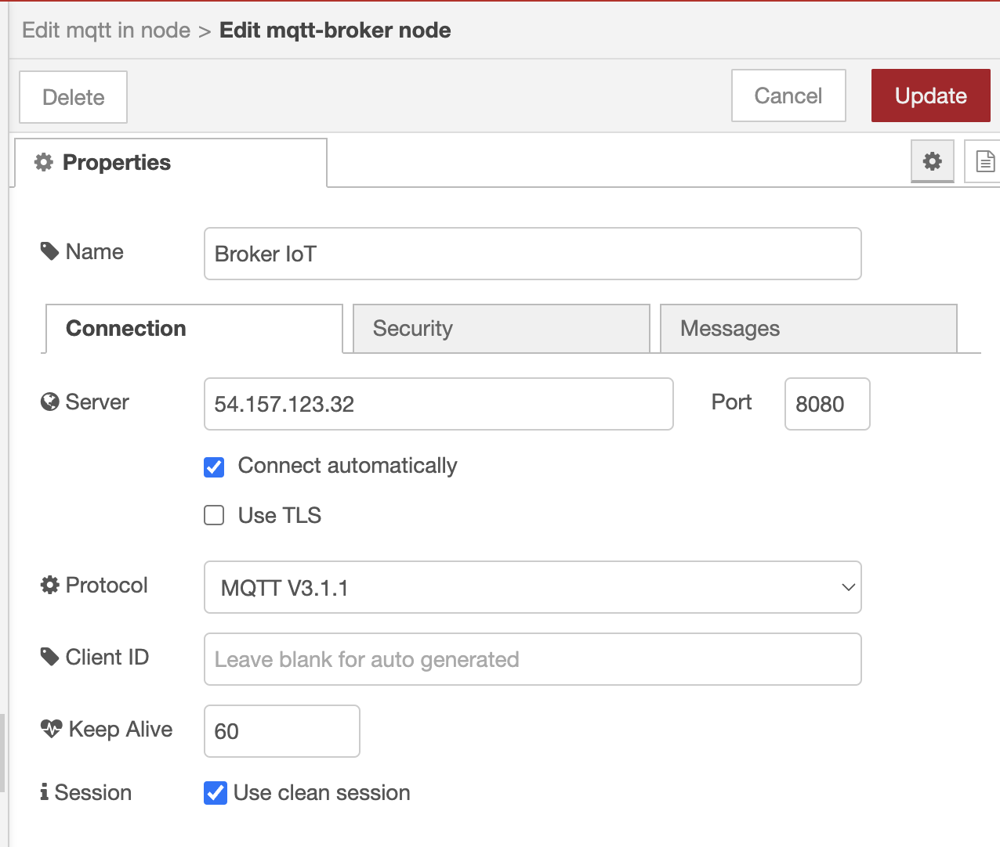
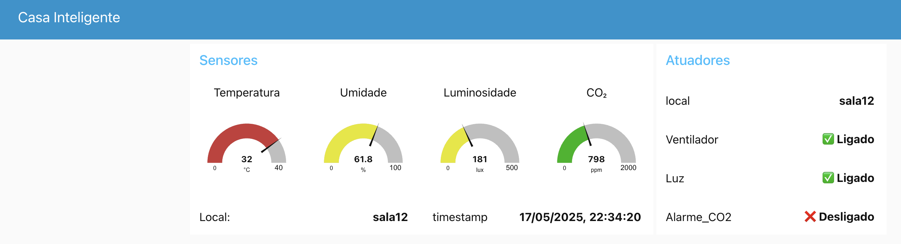
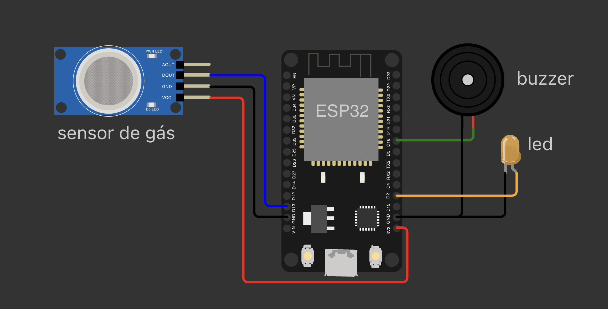

[](https://classroom.github.com/open-in-codespaces?assignment_repo_id=19611840)
## Checkpoint 3 – IoT

**Seu NOME: Vicenzo Castelli**
**Seu RM: 93647**

## Casa Inteligente

Este checkpoint possui **duas questões**, que têm por objetivo avaliar seus conhecimentos adquiridos sobre IoT, abrangendo o uso de MQTT, Node-RED e Arduino/ESP32.

Você foi contratado para implementar partes de um sistema de **casa inteligente**, que inclui monitoramento remoto de sensores e controle de dispositivos atuadores através do protocolo MQTT.

O sistema está estruturado com os seguintes elementos:

* **Broker MQTT:** disponível no IP `54.157.123.32`, porta `8080`
* **Identificação nos tópicos MQTT:** utilize `<seu_id>` correspondente ao número da sua matrícula

A estrutura dos tópicos MQTT é:

| Aplicação     | Publica em (envia)               | Subscreve em (recebe)            |
| ------------- | -------------------------------- | -------------------------------- |
| Node-RED      | `ambiente/comandos/<seu_id>`     | `ambiente/sensores/<seu_id>`     |
| Arduino/ESP32 | `ambiente/sensores_gas/<seu_id>` | `ambiente/comandos_gas/<seu_id>` |

### Broker MQTT:



---

## Questão 1 (Node-RED e Dashboard) – até 5 pontos

**A)** **Subscrição e Visualização dos Dados** (2,5 pontos)

Crie um fluxo no Node-RED para:

* Subscrever ao tópico de sensores (`ambiente/sensores/<seu_id>`)
* Interpretar os dados JSON recebidos e exibir as informações no Dashboard de maneira clara e organizada

**Critérios:**

* Conexão correta ao MQTT
* Interpretação correta dos dados JSON recebidos
* Dashboard exibindo corretamente os valores recebidos (com tratamento correto do timestamp)

> **Exemplo JSON recebido:**
>
> ```json
> {
>   "local": "sala<seu_id>",
>   "timestamp": "2025-05-16T15:45:00Z",
>   "sensores": {
>     "temperatura": 29.3,
>     "umidade": 68.5,
>     "luminosidade": 110,
>     "co2": 870
>   }
> }
> ```
>
> **DICA para tratar timestamp:**
>
> ```js
> let date = new Date(msg.payload.timestamp);
> msg.payload.timestamp = date.toLocaleString('pt-BR');
> return msg;
> ```

**B)** **Lógica de Decisão e Publicação dos Comandos** (2,5 pontos)

Implemente a lógica abaixo no Node-RED para decidir quais atuadores serão acionados:

| Sensor       | Condição    | Ação esperada      |
| ------------ | ----------- | ------------------ |
| Temperatura  | >= 28°C     | `ventilador: true` |
| Umidade      | >= 70%      | `ventilador: true` |
| Luminosidade | < 200       | `luz: true`        |
| CO₂          | >= 1000 ppm | `alarme_co2: true` |

Publique os comandos no tópico: `ambiente/comandos/<seu_id>` em formato JSON conforme exemplo:

```json
{
  "local": "sala<seu_id>",
  "acionar": {
    "ventilador": true,
    "luz": true,
    "alarme_co2": false
  }
}
```

**Critérios:**

* Aplicação correta das regras de decisão
* Exibição clara dos comandos no Dashboard
* Publicação correta e JSON bem formado

### Dashboard esperado



---

## Questão 2 (Arduino/ESP32 com Sensor MQ2) – até 5 pontos

> **IMPORTANTE**: Essa questão deve ser implementada no arquivo `main.cpp` em `questao2/src`. 
>
> **DICA**
> - Um código de exemplo está disponivel em `exemplo-iot` e serve como guia IoT.
> - Para utilizar o sensor de gás `RODE E TESTE` o código de exemplo em `questao2` 
>
> Lembre-se:
> - Não esquecer de dar `build` no código antes de iniciar a simulação no `Wokwi`.
> 



**A)** **Detecção de Gás e Publicação MQTT** (2,5 pontos)

Modifique o código em `main.cpp` em `questao2/src` para que:

* Leia periodicamente o sensor MQ2
* Publique uma mensagem MQTT indicando a detecção de gás (valor booleano `true` ou `false`)

**Formato da mensagem publicada:**

```json
{
  "local": "cozinha<seu_id>",
  "gas_detectado": true
}
```

**Critérios:**

* Conexão correta ao Broker MQTT
* Leitura e interpretação corretas do sensor MQ2
* Mensagem JSON correta e bem formada

**B)** **Recepção de Comandos e Acionamento dos Atuadores** (2,5 pontos)

Altere o seu código para que fazer o item A e:

* Subscrever ao tópico MQTT (`ambiente/comandos_gas/<seu_id>`)
* Ativar/desativar atuadores (LED e buzzer) conforme comandos recebidos

**Formato dos comandos recebidos:**

```json
{
  "acionar_led": true,
  "acionar_buzzer": true
}
```

**Critérios:**

* Subscrever corretamente ao tópico MQTT
* Interpretar corretamente os comandos JSON
* Atuar corretamente sobre LED e buzzer

---

## Teste e Validação das Questões

Ao finalizar cada questão, chame o professor para validar presencialmente o funcionamento completo dos seus sistemas. Serão avaliadas:

* Publicações corretas das mensagens
* Recepção correta dos comandos
* Acionamento correto dos dispositivos e exibição correta no Dashboard.
